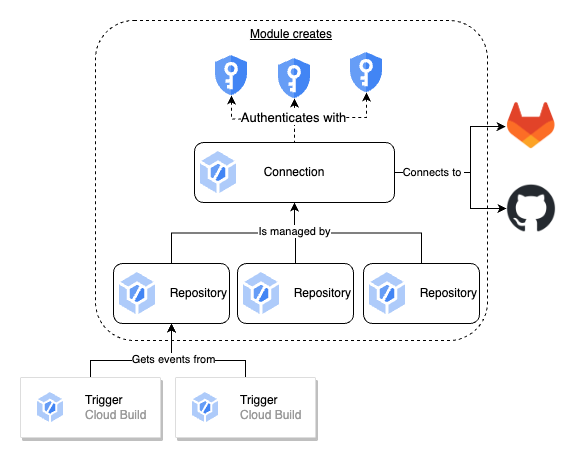

# Cloud Build 2nd Gen Connection
Google Cloud Build [2nd Gen connections](https://cloud.google.com/build/docs/repositories#repositories_2nd_gen) allow you to connect to GitHub, GitHub Enterprise, and GitLab (including Self Hosted).

This module creates the secrets as well as the required IAM to allow the [Cloud Build Service Agent](https://cloud.google.com/build/docs/securing-builds/configure-access-for-cloud-build-service-account#service-agent-permissions) to access the secrets and set up the connection to the chosen host. Additionally, you are able to associate one or more repositories with the created connection.

The diagram below shows how the different components of Cloud Build 2nd Gen work together and which are provided by this module 


## How to use this Module
Add the module code with required inputs for the Git Provider you are using. Note that a different set of inputs are required for different providers. The first time you instantiate the module the input `create_connection` should be `false` or not provided, this is because there is a dependency on the secret values being added via the Google Cloud Console or gcloud. Once you have added the secret versions, set `create_connection` to true and the connection as well as related repositories will be created.

For GitHub Enterprise and GitLab Enterprise Edition hosted in a private network there is additional documentation for [GitHub](https://cloud.google.com/build/docs/automating-builds/github/build-repos-from-github-enterprise-private-network?generation=2nd-gen) and [GitLab](https://cloud.google.com/build/docs/automating-builds/gitlab/build-repos-from-gitlab-enterprise-edition-private-network). More specific [Service directory documentation](https://cloud.google.com/service-directory/docs/overview) also exists.

### Secrets setup
Each Git provider has different requirements to create the connection. Review the [Google documentation](https://cloud.google.com/build/docs/repositories#repositories_2nd_gen) to see what settings are required for each provider ahead of creating the module.

### Inputs Required

| Name | Description | Git Provider | Type | Default | Required |
|---|---|---|---|---|---|
|  [app\_id](#input\_app\_id) | Unique identifier for the GitHub Enterprise Application for Cloud Build | ghe | `number` | `null` | no |
|  [app\_slug](#input\_app\_slug) | URL friendly name of the GitHub Enterprise application | ghe | `string` | `null` | no |
|  [connection\_name](#input\_connection\_name) | Name of the Cloud Build connection | All | `string` | n/a | yes |
|  [create\_connection](#input\_create\_connection) | Create the connection resource only after the secrets have been correctly set. | All | `bool` | `false` | no |
|  [git\_provider](#input\_git\_provider) | Which git provider you are connecting to. Options are: gitlab, github, ghe | All | `string` | n/a | yes |
|  [git\_url](#input\_git\_url) | The Host URI of the Git Server you are connecting to | GitLab, GHE | `string` | `null` | no |
|  [installation\_id](#input\_installation\_id) | Unique Identifier for the installation of the Cloud Build application in your Organisation (One application can have many installations) | ghe | `number` | `null` | no |
|  [labels](#input\_labels) | List of labels to apply to the Secret resources | All | `map(string)` | `null` | no |
| <a name="input_project_id"></a> [project\_id](#input\_project\_id) | The project to create resources in. Defaults to provider project | All | `string` | `null` | no |
|  [repositories](#input\_repositories) | List of repositories to create connection to as name = value pair. Defaults to creating none | All | `map(string)` | `{}` | no |
|  [service\_name](#input\_service\_name) | Service Directory name in format: `projects/{project}/locations/{location}/namespaces/{namespace}/services/{service}`. | GitLab, GHE | `string` | `null` | no |
|  [ssl\_ca](#input\_ssl\_ca) | SSL certificate to use for requests to GitHub Enterprise/Self-Hosted GitLab | GitLab, GHE | `string` | `null` | no |

### Resources Created

| Name | Type |
|------|------|
| [google_cloudbuildv2_connection.connection](https://registry.terraform.io/providers/hashicorp/google/latest/docs/resources/cloudbuildv2_connection) | resource |
| [google_cloudbuildv2_repository.cloudbuild_repo](https://registry.terraform.io/providers/hashicorp/google/latest/docs/resources/cloudbuildv2_repository) | resource |
| [google_secret_manager_secret.ghe_private_key](https://registry.terraform.io/providers/hashicorp/google/latest/docs/resources/secret_manager_secret) | resource |
| [google_secret_manager_secret.ghe_webhook](https://registry.terraform.io/providers/hashicorp/google/latest/docs/resources/secret_manager_secret) | resource |
| [google_secret_manager_secret.github_oauth](https://registry.terraform.io/providers/hashicorp/google/latest/docs/resources/secret_manager_secret) | resource |
| [google_secret_manager_secret.gitlab_authorizer](https://registry.terraform.io/providers/hashicorp/google/latest/docs/resources/secret_manager_secret) | resource |
| [google_secret_manager_secret.gitlab_read_authorizer](https://registry.terraform.io/providers/hashicorp/google/latest/docs/resources/secret_manager_secret) | resource |
| [google_secret_manager_secret.gitlab_webhook](https://registry.terraform.io/providers/hashicorp/google/latest/docs/resources/secret_manager_secret) | resource |
| [google_secret_manager_secret_iam_member.cloud_build_authorizer_member](https://registry.terraform.io/providers/hashicorp/google/latest/docs/resources/secret_manager_secret_iam_member) | resource |
| [google_secret_manager_secret_iam_member.cloud_build_ghe_private_key_member](https://registry.terraform.io/providers/hashicorp/google/latest/docs/resources/secret_manager_secret_iam_member) | resource |
| [google_secret_manager_secret_iam_member.cloud_build_ghe_webhook_member](https://registry.terraform.io/providers/hashicorp/google/latest/docs/resources/secret_manager_secret_iam_member) | resource |
| [google_secret_manager_secret_iam_member.cloud_build_github_oauth_member](https://registry.terraform.io/providers/hashicorp/google/latest/docs/resources/secret_manager_secret_iam_member) | resource |
| [google_secret_manager_secret_iam_member.cloud_build_read_authorizer_member](https://registry.terraform.io/providers/hashicorp/google/latest/docs/resources/secret_manager_secret_iam_member) | resource |
| [google_secret_manager_secret_iam_member.cloud_build_webhook_member](https://registry.terraform.io/providers/hashicorp/google/latest/docs/resources/secret_manager_secret_iam_member) | resource |
| [google_project.project](https://registry.terraform.io/providers/hashicorp/google/latest/docs/data-sources/project) | data source |


### Outputs Generated

The location of the Secrets created for the selected Git Provider will be provided. The other Secret IDs will be fixed to `null`


| Name | Description |
|------|-------------|
| <a name="output_connection_id"></a> [connection\_id](#output\_connection\_id) | Unique Identifier for the connection in format: `projects/{{project}}/locations/{{location}}/connections/{{name}}` |
| <a name="output_ghe_private_key_secret_id"></a> [ghe\_private\_key\_secret\_id](#output\_ghe\_private\_key\_secret\_id) | Secret ID for GHE Private Key in format: `projects/{{project}}/secrets/{{secret_id}}` |
| <a name="output_ghe_webhook_secret_id"></a> [ghe\_webhook\_secret\_id](#output\_ghe\_webhook\_secret\_id) | Secret ID for GHE Webhook in format: `projects/{{project}}/secrets/{{secret_id}}` |
| <a name="output_github_oauth_secret_id"></a> [github\_oauth\_secret\_id](#output\_github\_oauth\_secret\_id) | Secret ID for GitHub Oauth in format: `projects/{{project}}/secrets/{{secret_id}}` |
| <a name="output_gitlab_authorizer_secret_id"></a> [gitlab\_authorizer\_secret\_id](#output\_gitlab\_authorizer\_secret\_id) | Secret ID for Gitlab Read Write Authorizer in format: `projects/{{project}}/secrets/{{secret_id}}` |
| <a name="output_gitlab_read_authorizer_secret_id"></a> [gitlab\_read\_authorizer\_secret\_id](#output\_gitlab\_read\_authorizer\_secret\_id) | Secret ID for Gitlab Read Only Authorizer in format: `projects/{{project}}/secrets/{{secret_id}}` |
| <a name="output_gitlab_webhook_secret_id"></a> [gitlab\_webhook\_secret\_id](#output\_gitlab\_webhook\_secret\_id) | Secret ID for Gitlab Webhook in format: `projects/{{project}}/secrets/{{secret_id}}` |
| <a name="output_repository_ids"></a> [repository\_ids](#output\_repository\_ids) | Unique identifier for the repository resources managed by the connection. Access via `module_name.repository_ids[$var.repositories.key]`. In format: `projects/{{project}}/locations/{{location}}/connections/{{parent_connection}}/repositories/{{name}}` |


## Example
``` terraform
module "cloudbuild_v2" {
  source = "github.com/kasna-cloud/terraform-google-cloud-build-gen-2"

  create_connection = true # set to true once the secrets are added

  connection_name     = "example"
  connection_location = var.region

  git_url = "https://gitlab.com"
  
  repositories = {
    gitlab  = "https://gitlab.com/gitlab-org/gitlab.git"
    another = "https://gitlab.com/inkscape/inkscape.git"
  }
  git_provider = "gitlab"

  labels = {
    test = "val"
  }
}
```